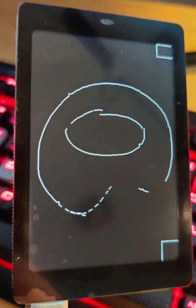

The WT32-SC01 module is an ESP32 dev board which has a capacitive touch screen mounted on the same PCB.
I have been looking for a capacitive touch screen dev board for a while and now I finally found one, so I might as well document everything here
in case someone else finds the same module.



The documentation on this module is quite bad, but luckily there is already a couple of projects, so we don't have to reverse engineer the entire thing.

### Parts
Okay so in paper this display has a lot of good parts. I will try to get the most important components on this list:
* ESP32-WROVER-B | Main MCU
* CP2104 (SIL2104) | USB <-> UART Bridge
* FT6336U | Touch panel controller
* ST77xx -based display driver (might be ST7796S?)
* 320x480 display
* 2 pcs of 2x20 connectors with the frickin 2.0mm pitch, glhf getting anything plugged into that. Luckily both of them are SMD connectors with quite long leads so soldering wires to them shouldn't be that hard.

Key notes:
* This module DOES NOT HAVE any sort of battery management circuitry, so you have to implement it by yourself if you want to make this battery powered.
* There is a PDF of this module, but there is not a lot in there. At least the pinouts of the connectors are there.

### Pinout
This list might be incomplete, but I'll add more pins along the way
| Arduino IDE pin   | WT32-SC01 Display |
| ------------- | ------------- |
| 12 | TFT_MISO |
| 13  | TFT_MOSI |
| 14 | TFT_SCLK |
| 15  | TFT_CS |
| 21  | TFT_DC |
| 22 | TFT_RST |
| 23  | TFT_BACKLIGHT |

| Arduino IDE pin   | WT32-SC01 Touch controller |
| ------------- | ------------- |
| 19 | I2C_SCL |
| 18  | I2C_SDA |

NOTE: To be able to use the I2C-interface on these pins you must use
```Wire.begin(18,19);``` to be able to get it working. Most of the libraries seem to be using only ```Wire.begin();``` which didn't work for me, and I'd guess that the default I2C pins might be different.
For example if you want to use Adafruit_FT6206 you have to change the ```Wire.begin();``` in ```Adafruit_FT6206.cpp``` on line 57 to ```Wire.begin(18,19);```
